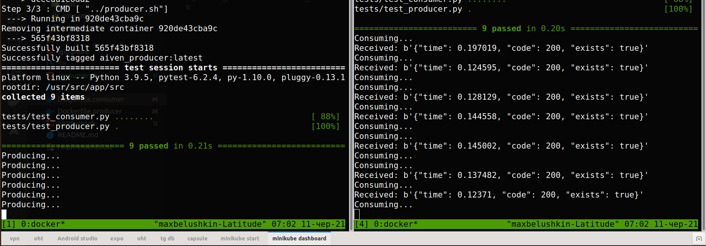

# Aiven python tech assessment

## Description of the task
Periodical web site health checker should be created. Health checker should use aiven services: Postgres DB and Kafka queue.

## Implementation details
Application consists of 2 parts:
- Producer, which connects to the kafka queue and sends the result of measuring of the page speed load, response code and pre defined string existance to the queue. 
- Consumer, which connects to the same queue and do polling. Both parts are built with docker and can be launched on ECS or GCP Cloud Run.

## How application looks like
Console view


## How to build and run application

### Build base image first
```
docker build -f Dockerfile -t aiven .
```

### Build producer image and run
```
docker build -f Dockerfile.producer -t aiven_producer . && docker run --env-file .env -it aiven_producer
```

### Build consumer image and run
```
docker build -f Dockerfile.consumer -t aiven_consumer . && docker run --env-file .env -it aiven_consumer
```

### Technologies used in the assessment
- Python 3
- Docker
- PostgreSQL
- Kafka

### Prerequisites
- Docker 

### Contributors
@belushkin

### License
MIT License
